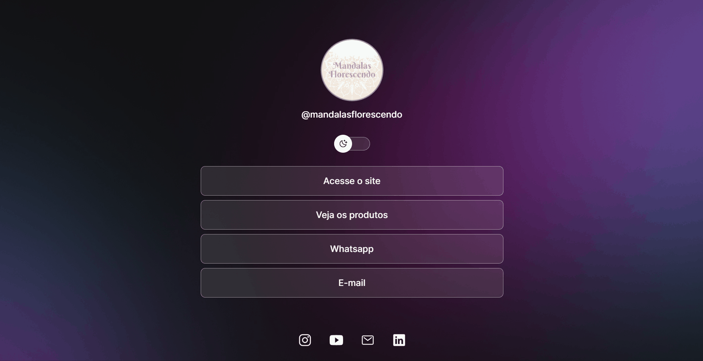

<h1 align="center"> DevLinks </h1>

 

  

## 💻 Projeto

O DevLinks é um agregador de links para usar como cartão de visitas online. 

Este é o meu primeiro projeto!   
Através dele pude aprender sobre HTML e CSS e um básico de JS, usando layout disponibilizado pelo Figma.  
As maiores dificuldades foram na absorção de todo o conteúdo, por ainda ser algo muito novo para mim, mas foi gratificante poder concluir esse projeto.  
Ele é apenas um exemplo, por isso os links não estão funcionando.

Foi realizado a partir do projeto Discover da [Rocketseat](https://lp.rocketseat.com.br/devlinks/inscricao?utm_source=github&utm_medium=descricao&utm_campaign=capture-devlinks&utm_term=organic&utm_content=descricao-github-mayk-brito).

## 🚀 Tecnologias

Esse projeto foi desenvolvido com as seguintes tecnologias:

- HTML e CSS
- JavaScript
- Git e Github
- Figma

